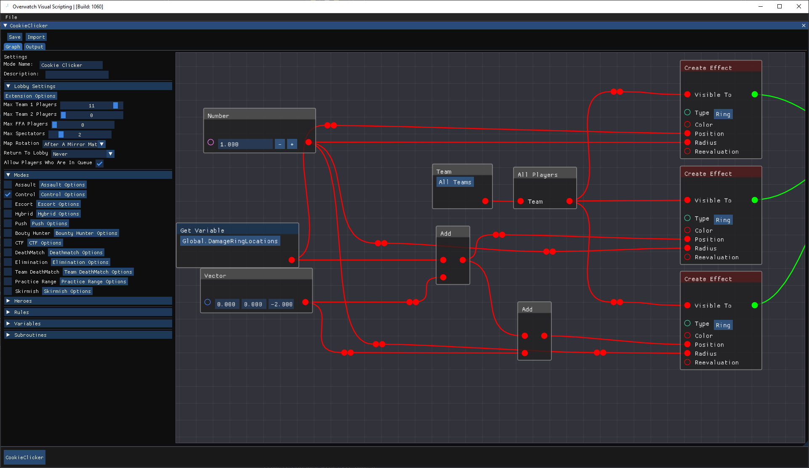
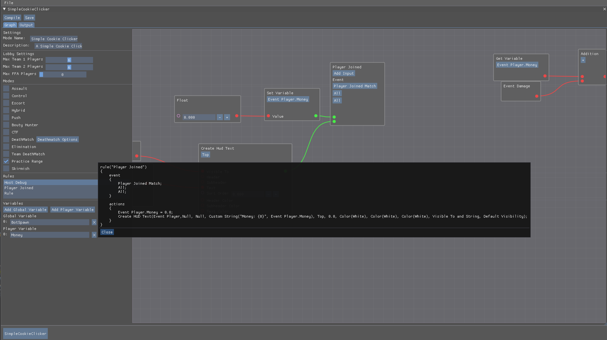
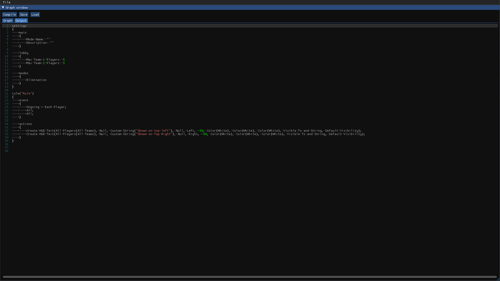
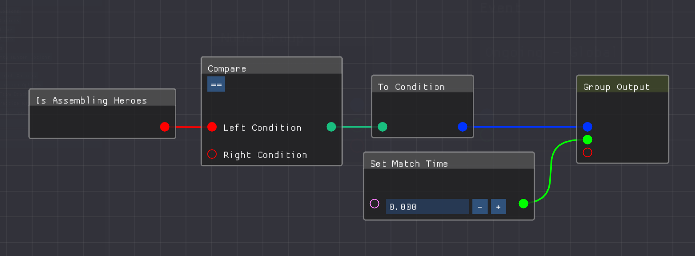
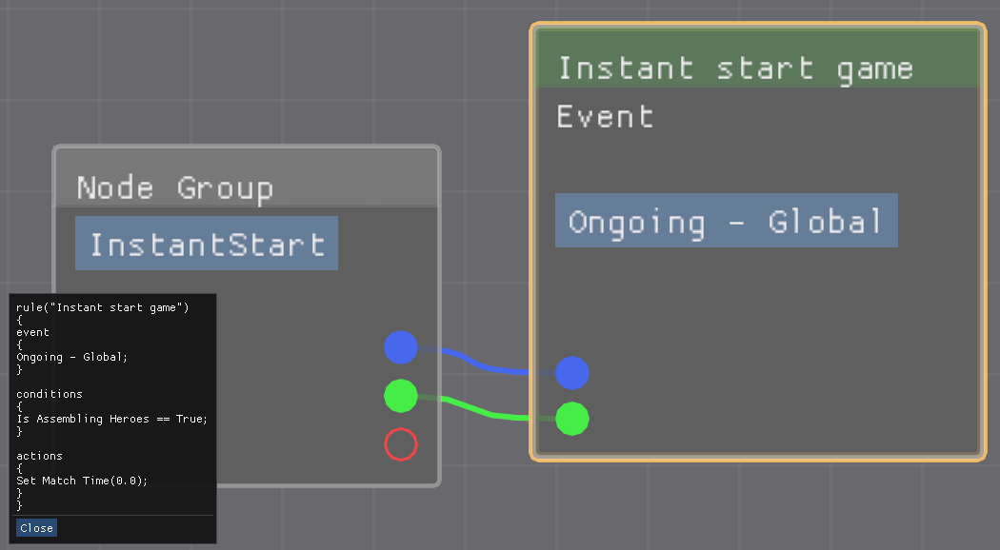

# OverwatchVisualScripting

## Requirements
### **If you are not using the Bundle read the following requirements**
  
Requires Java 17 installed and setup, you can check your java version in your command line by typing: `java -version`

Download the Latest release [HERE](https://github.com/blockout22/OverwatchVisualScripting/releases/latest)

 

### Application not Launching?
We can run it on the command line to see what errors we are getting

* Open Command line/PowerShell
* cd to the directory your OverwatchVisualScripting.jar is located
* run OverwatchVisualScripting.jar with the following command `java -jar OverwatchVisualScripting.jar`
* any errors that popup can help debug why the Application wont Launch
* any issues you can't debug alone can be assisted with by opening an [Issue](https://github.com/blockout22/OverwatchVisualScripting/issues)

## Images

 Write Overwatch Scripts using node based scripting

 

