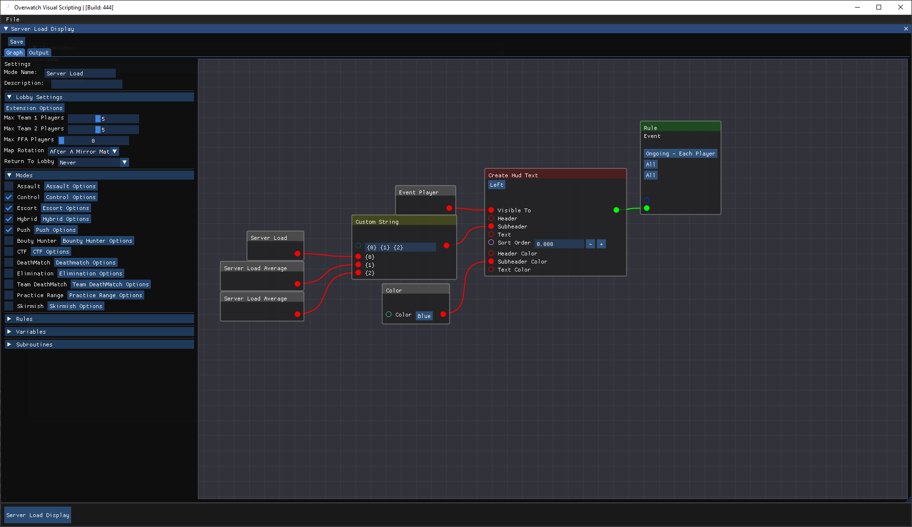

# OverwatchVisualScripting

## requirements
Requires Java 17 installed and setup, you can check your java version in your command line by typing: `java -version`

## Images

 Write Overwatch Scripts using node based scripting

 

